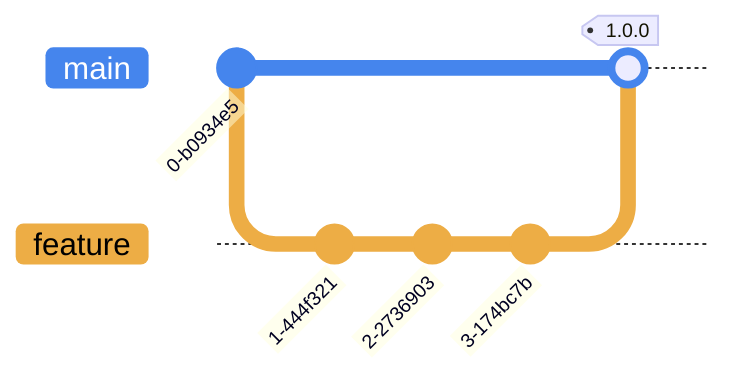

# ais-tuxedo-scripts

Jinja2 template maintenance scripts for [ais-tuxedo-stack](https://github.com/companieshouse/ais-tuxedo-stack) services.

These scripts are deployed via CI/CD jobs that utilise an Ansible playbook and are grouped by the service that they relate to. For more information refer to the [ais-tuxedo-stack deployment branch](https://github.com/companieshouse/ais-tuxedo-stack/tree/deployment) and [Informix maintenance jobs](https://github.com/companieshouse/ais-tuxedo-stack/tree/deployment/roles/management#informix-maintenance-jobs) sections of that project's 'management' role documentation.

## Template scripts

The following sections detail in brief the function of each script:

Informix

| Filename | Description |
|--------|--------|
| `check_continuous_backups.j2` | Check for the presence of continuous logical log backup processes and generate email alerts if neccessary. |
| `level_zero_backup.j2` | Perform a level zero database backup and archive the level zero backup file. |
| `logging.j2` | Common logging functions for use in other scripts. |
| `logical_log_archive.j2` | Perform logical log backup and restart continuous backups for the specified Informix database. |
| `menu.j2` | Interactive menu-based system for `informix` user database management. |
| `stop_all_logicals.j2` | Stop all logical log continuous backup processes. |
| `update_statistics.j2` | Generate and update database statistics regarding table, row, and page-count in the systables system catalog table. |

## Branching Strategy

This project uses a trunk-based branching strategy and changes merged to the `main` branch are incorporated into versioned artefacts via the [ais-tuxedo-scripts](https://github.com/companieshouse/ci-pipelines/blob/master/pipelines/platform/team-platform/ais-tuxedo-scripts) pipeline:

## License

This project is subject to the terms of the [MIT License](/LICENSE).
